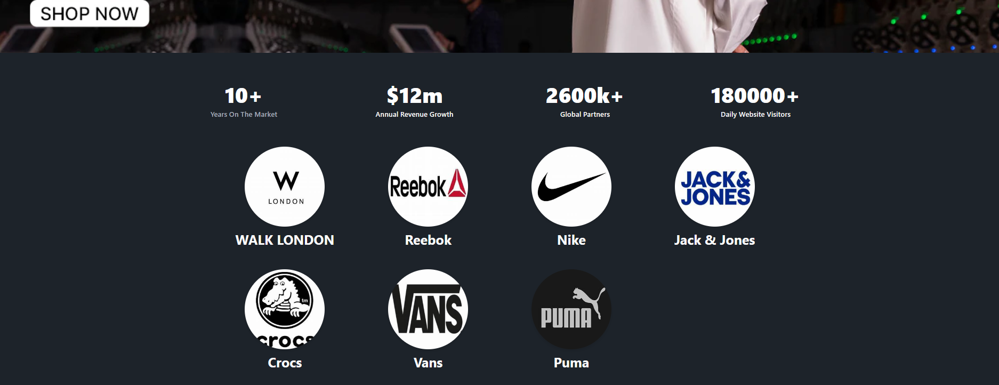
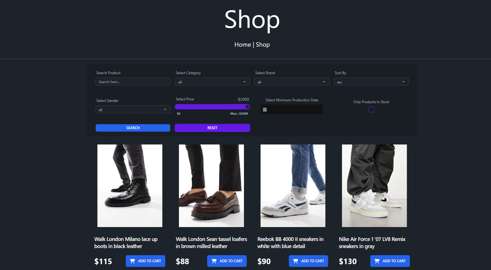
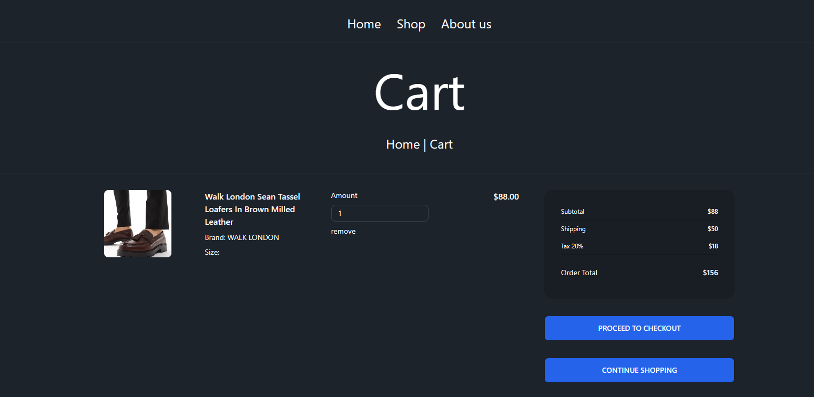
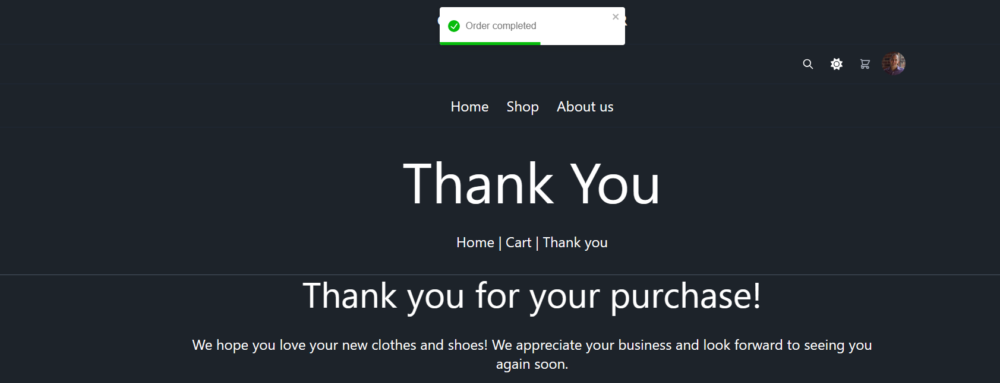

# Clothing & Sports Wear

An e-commerce web application built with React, Redux, and Vite, providing a seamless shopping experience. 

## Features

- **Landing Page**: Displays a list of available brands and trending products.
- **Brand Page**: Clicking on a brand redirects to a page containing all products of that brand.
- **Shop Page**: Lists all products with filters for brand, price, category, gender, etc.
- **Cart Page**: Allows users to view and manage items in their cart.
- **Checkout Page**: Facilitates order placement.
- **Thank You Page**: Confirms that the order has been placed successfully.

## Screenshots

### Landing Page


### Shop Page


### Cart Page


### Thank You Page


## Getting Started

### Prerequisites

- Node.js (version 14 or higher)
- npm (version 6 or higher)

### Installation

1. Clone the repository:
    ```sh
    git clone https://github.com/Amin-AQ/ecommerce-shop.git
    cd ecommerce-shop
    ```

2. Install dependencies:
    ```sh
    npm install
    ```

### Running the Application

To start the development server and the JSON server, run:
```sh
npm start
```

This will concurrently start the Vite development server and the JSON server.

### Building the Application

To create a production build, run:
```sh
npm run build
```

### Previewing the Production Build

To preview the production build locally, run:
```sh
npm run preview
```

## Project Structure

```sh
ecommerce-shop/
├── public/
├── src/
│   ├── assets/
│   ├── components/
│   ├── data/
│   ├── pages/
│   ├── features/
|   ├── styles/
│   ├── App.jsx
│   ├── index.jsx
│   └── main.jsx
├── .eslintrc.js
├── package.json
├── postcss.config.js
├── tailwind.config.js
├── vite.config.js
└── README.md
```

## Dependencies

- **React**: UI library
- **Redux**: State management
- **React Router DOM**: Routing
- **Axios**: HTTP client
- **React Toastify**: Notifications
- **Tailwind CSS**: Utility-first CSS framework
- **DaisyUI**: Tailwind CSS components
- **ESLint**: Linting
- **Vite**: Build tool
- **JSON Server**: Mock API

## Dev Dependencies

- **@vitejs/plugin-react**: React plugin for Vite
- **@tailwindcss/typography**: Tailwind CSS typography plugin
- **eslint**: JavaScript linter
- **eslint-plugin-react**: React specific linting rules for ESLint
- **eslint-plugin-react-hooks**: Linting rules for React hooks
- **eslint-plugin-react-refresh**: ESLint plugin for React Refresh

## Scripts

- **start**: Starts the development server and JSON server concurrently
- **dev**: Starts the Vite development server
- **build**: Builds the application for production
- **lint**: Runs ESLint
- **preview**: Previews the production build
- **json**: Starts the JSON server

## Data

The JSON server watches the `src/data/db.json` file and runs on port 8080.

Enjoy building and shopping!
